# Front-end solo
A collection of diverse web applications and clones showcasing front-end development skills.
## Projects Overview

17. [React Component](./React%20Component/)
- **Technologies**: React
- **Live Demo**: 
https://wondrous-cucurucho-45cbf2.netlify.app/
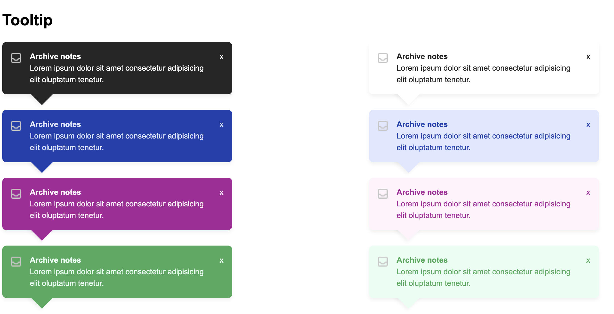

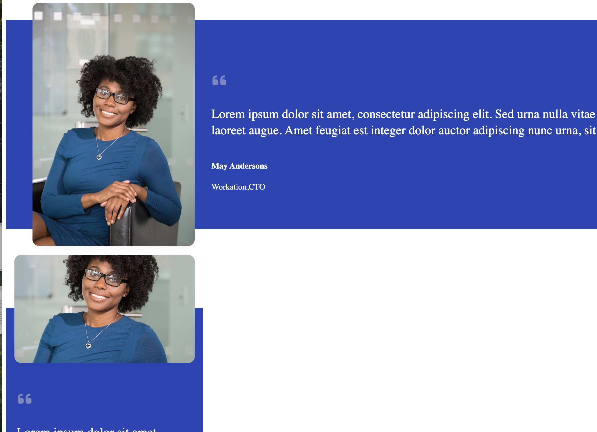

16. [Tenzies Game](./Tenzies%20game/)
- **Technologies**: React
- **Features**: Roll the virtual dice and hold the ones you want to keep, while continuing to roll the remaining dice. Win the game by strategically holding dice until all show the same value, creating a challenging yet engaging game of chance and strategy.
- **Live Demo**: 
https://euphonious-speculoos-56e214.netlify.app/
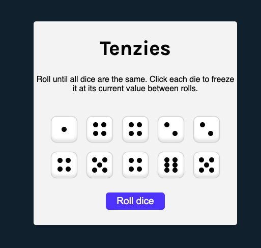
15. [Chef Claude with HuggingFace AI](./ChefClaude%20Ai/)

- **Technologies**: React, HuggingFace AI/Claude AI API, Netlify Serverless Function
- **Features**: Input ingredients you have on hand, AI-generated recipes tailored to your ingredients
- **Live Demo**: 
[Link to application via Netlify](https://bucolic-donut-db52bd.netlify.app/)
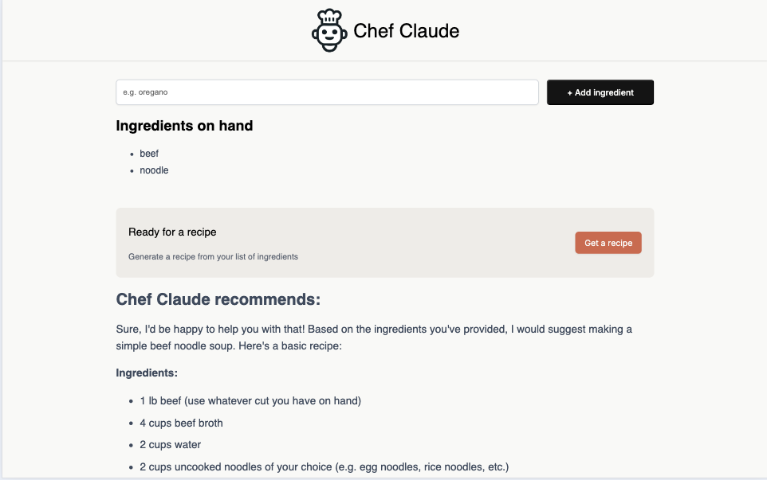

14. [Movie Watchlist - OMDB API](./Movie%20Watchlist%20Apps/)

- **Technologies**: JavaScript, API, Local Storage
- **Features**: Movie search, watchlist management
- **Live Demo**:
[Link to application via Netlify](https://splendid-hamster-74f516.netlify.app/)

13. [Color Scheme Generator- Color API](./color%20API/)
- **Technologies**: Color API, JavaScript
- **Features**: Dynamic color scheme generation
- **Live Demo**:
[Link to application via Netlify](resonant-chimera-65cfd1.netlify.app)
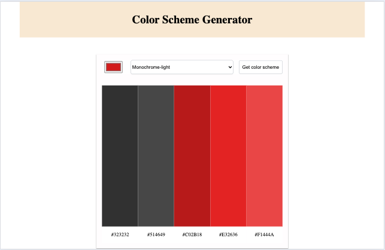
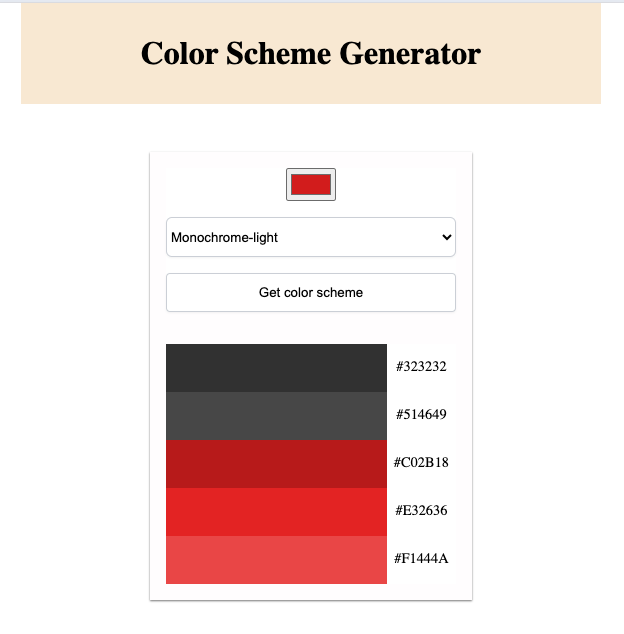

12. [Learning Journal](./Learning-journal/)
- **Technologies**: HTML, CSS, JavaScript
- **Features**: Personal blog-style journal
[Link to application via Netlify](https://learning-journal-kat.netlify.app/)
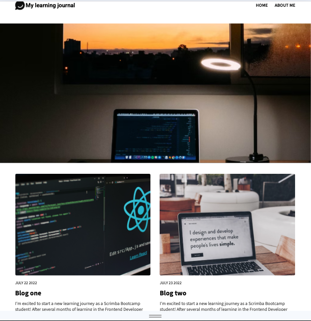
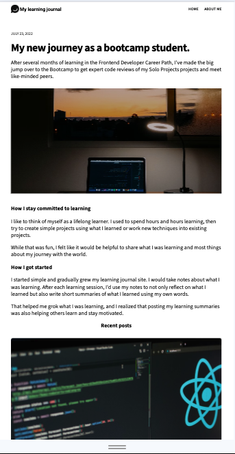
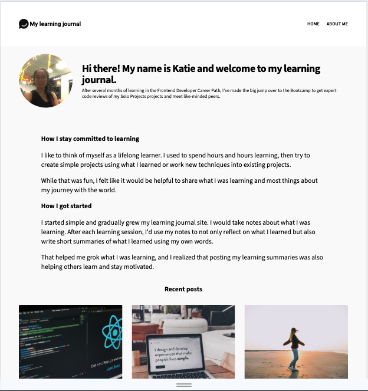

11. [Restaurant Ordering Apps](./Restaurant%20Ordering%20Apps/)
- **Technologies**: JavaScript, Dynamic Rendering
- **Features**: Interactive menu, order management
[Link to application via Netlify](https://fluffy-salmiakki-e1d2dc.netlify.app)

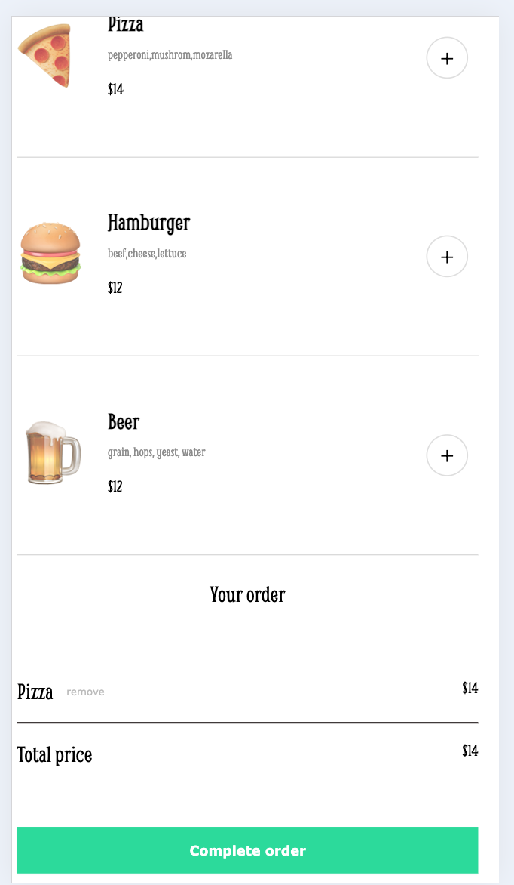
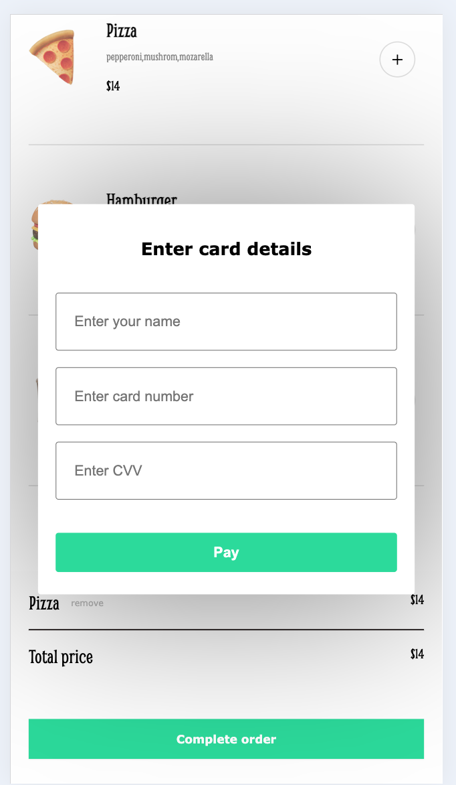

10. [Twister post clone](./Twister%20clone/)
- **Technologies**: HTML, CSS, JavaScript
- **Features**: Social media post interaction

9. [Instagram Post Clone](./Oldagram/)

[Link to application via Netlify](https://eloquent-sunshine-6c52d4.netlify.app/)

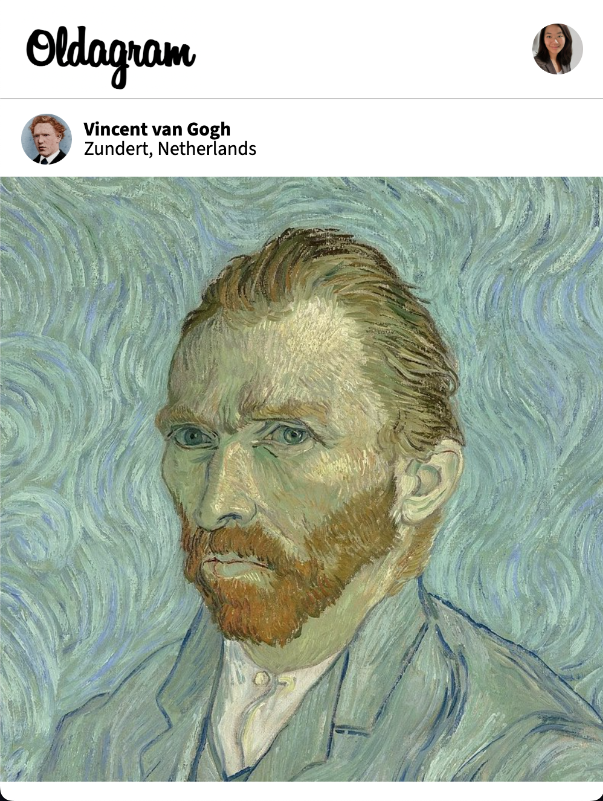

8. [Unit conversion apps](./Unit%20conversion/)
- **Technologies**: JavaScript
- **Features**: Convert between different units of measurement

[Link to application via Netlify](https://6757d689ba28beb3438e82e5--extraordinary-parfait-e02e63.netlify.app/)

7. [Chrome Extension- Save tabs](./Chrome%20Extension/)
- **Technologies**: JavaScript, Chrome API
- **Features**: Save and manage browser tabs
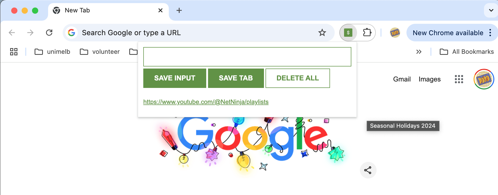

6. [Password Generator](./Password%20Generator/)
- **Technologies**: JavaScript
- **Features**: Generate secure passwords

[Link to application via Netlify](https://cheery-griffin-f4c6a5.netlify.app)

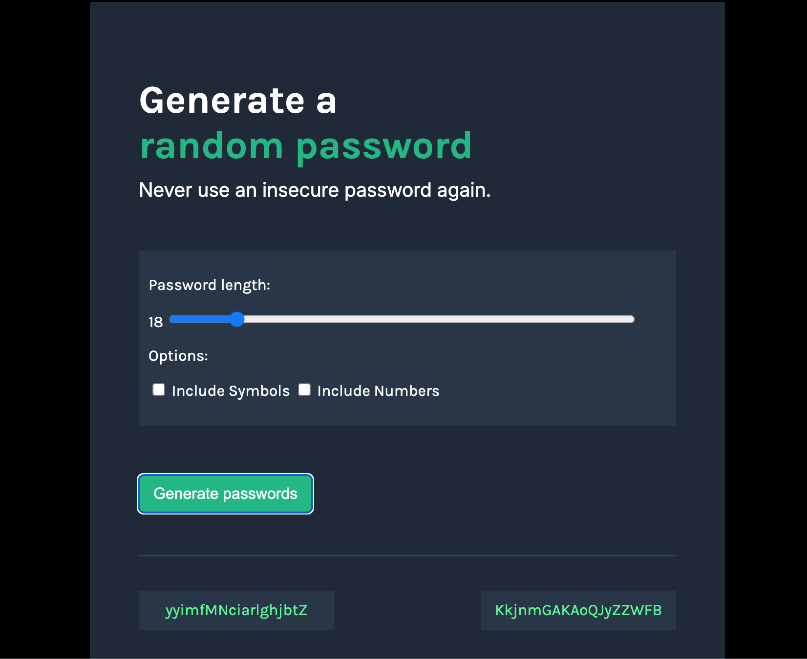

5. [BasketBall scoreboard](./Basketball%20Scoreboard/)
- **Technologies**: HTML, CSS, JavaScript
- **Features**: Real-time score tracking
[Link to Application via Netlify](https://marvelous-lokum-980e7e.netlify.app/)

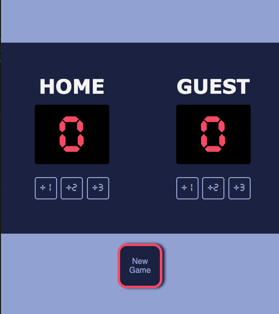

4. [Hometown homepage](./Hometown%20homepage/)

[Link to Webpage on Netlify](https://graceful-granita-31f70c.netlify.app)

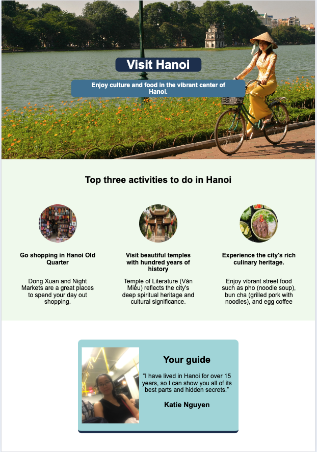

3. [Christmas launch page](./Launch%20page/)

2. [Business card](./Business%20card/)

1. [Google font-page clone](./Google%20search/)

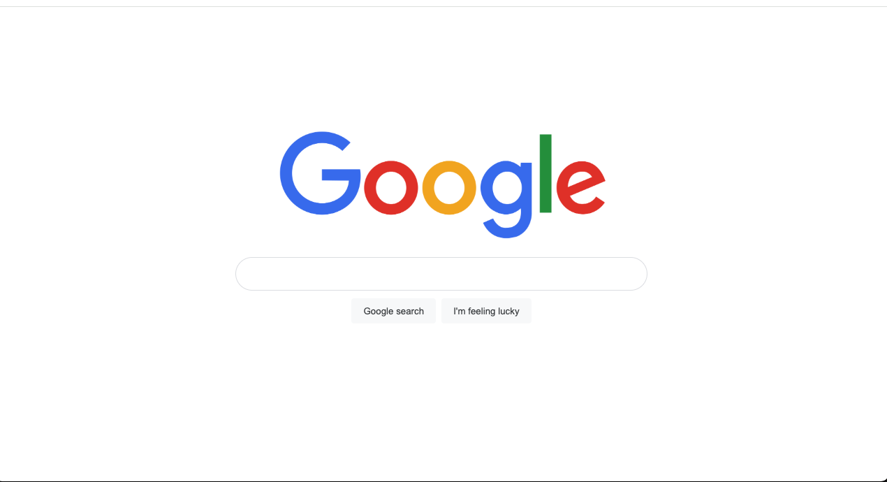

